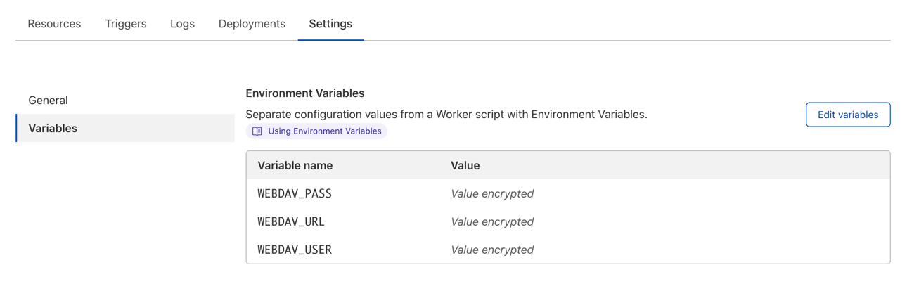

# file-server-cf-worker

Replace [sya-ri/file-server](https://github.com/sya-ri/file-server) by using Cloudflare Workers.
It's like a proxy for WebDAV and makes it easy to share files.

## How to deploy

### 1. Deploy to Cloudflare Workers

Press the button and follow the instructions to proceed with the setup.

#### About API Token

1. Select "Edit Cloudflare Workers".
2. Rename "Token name".
3. Select "Account Resources" to your account.
4. Select "Zone Resources" to your domain.

### 2. Setup environment variables

Add variables on the worker settings page.

- `WEBDAV_URL`
- `WEBDAV_USER`
- `WEBDAV_PASS`

### 3. (optional) Use custom domains

1. Open "Triggers" on the worker settings page.
2. Press "Add Custom Domain".
